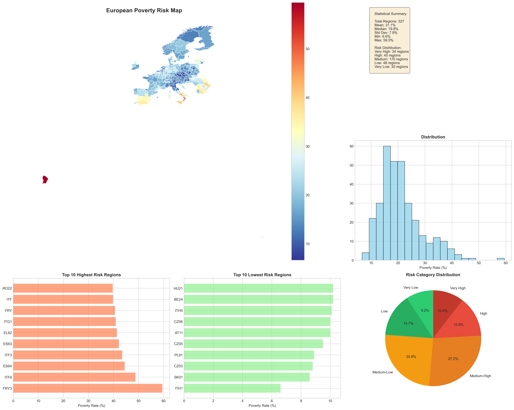
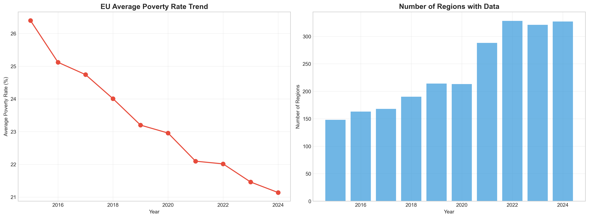
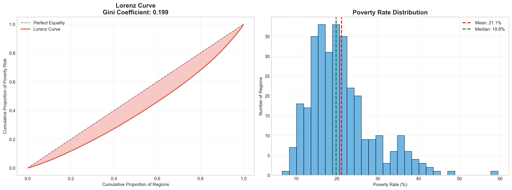
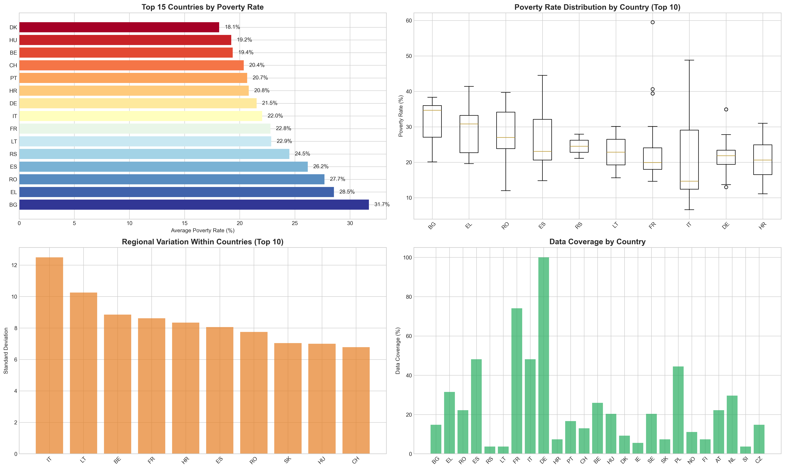
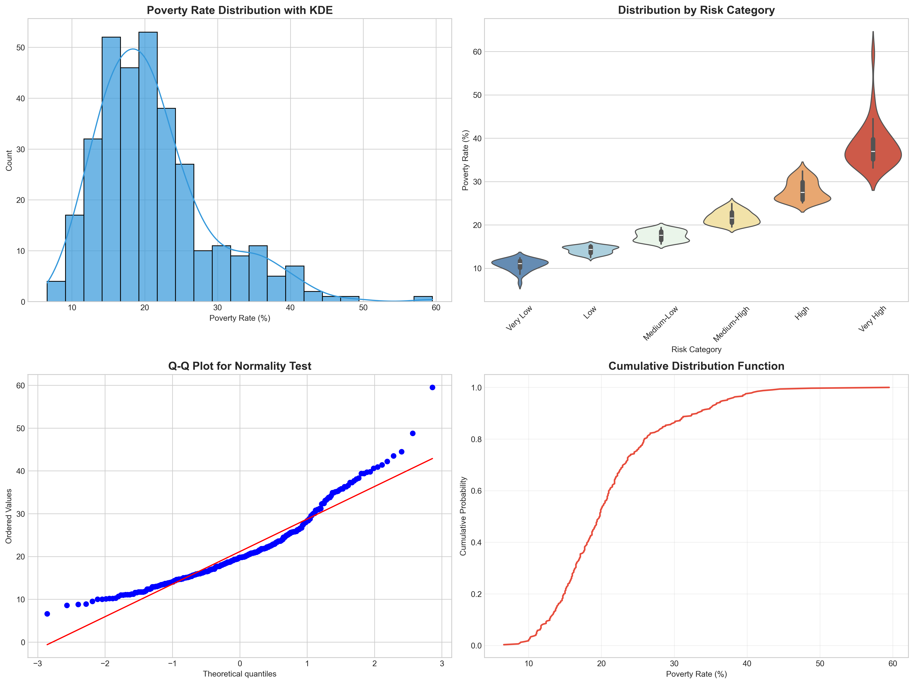
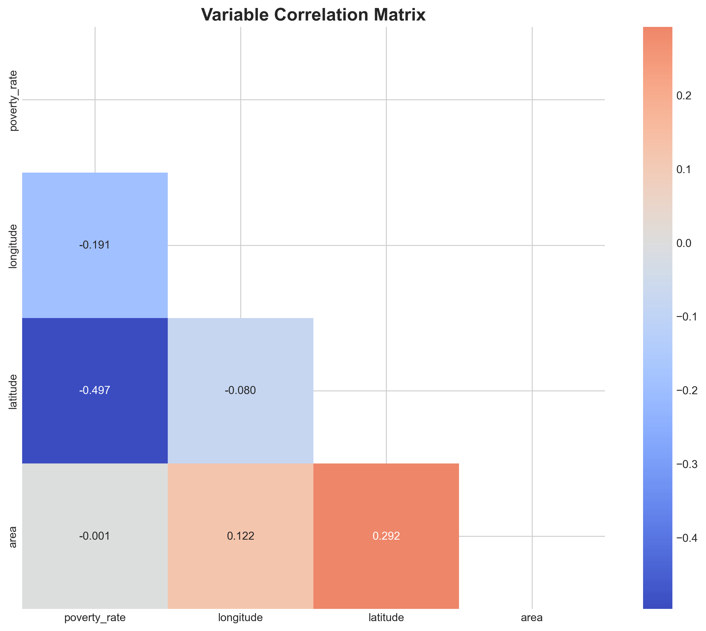
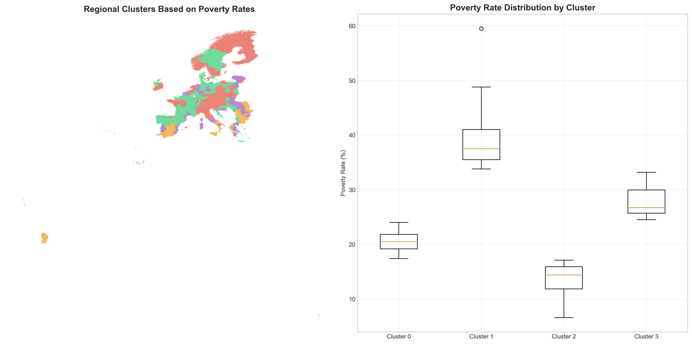
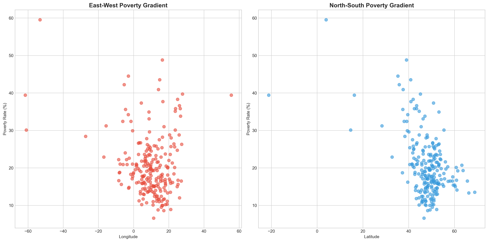
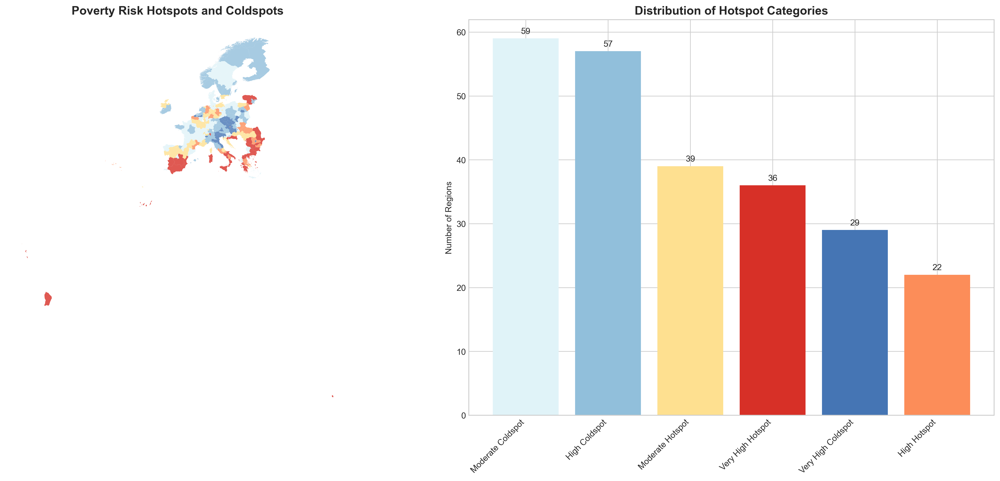

# EuroPovertyMapper 🌍📊

[](https://www.python.org/)
[](LICENSE)
[](https://ec.europa.eu/eurostat)

A comprehensive Python tool for analyzing and visualizing poverty risk across European regions using Eurostat data. Create stunning, publication-ready choropleth maps with advanced statistical analysis.

## 📋 Overview

EuroPovertyMapper processes real-time Eurostat data to generate high-quality visualizations of poverty risk across European NUTS2 regions. The project combines geospatial analysis, statistical processing, and professional visualization to provide insights into European social inequality patterns.



## ✨ Features

- **📊 Real-time Data**: Automated fetching from Eurostat API
- **🗺️ Professional Maps**: Multiple color schemes and styles
- **📈 Statistical Analysis**: Comprehensive regional and country-level insights
- **🎨 Customizable Visuals**: Ultra-high resolution (400 DPI) outputs
- **🔧 Robust Processing**: Handles data inconsistencies and missing values
- **📁 Multiple Formats**: PNG, PDF, SVG export options
- **🌐 Interactive Maps**: HTML-based interactive visualizations

## 🚀 Quick Start

### Installation

1. **Clone the repository**:
```bash
git clone https://github.com/zafariabbas68/EuroPovertyMapper.git
cd EuroPovertyMapper
```

2. **Install dependencies**:
```bash
pip install -r requirements.txt
```

### Basic Usage

```python
from euro_poverty_mapper import EuroPovertyMapper

# Initialize the mapper
mapper = EuroPovertyMapper()

# Generate a poverty risk map
fig, analysis = mapper.generate_map(year=2024, style='ultra_visual')

# Save the visualization
mapper.save_map(fig, 'europe_poverty_2024.png')

# View statistical analysis
print(analysis.summary)
```

## 📊 Sample Output

### Statistical Summary (2024 Data)
```
EUROPEAN POVERTY RISK ANALYSIS
================================
📊 BASIC STATISTICS:
• Regions analyzed: 327 NUTS2 regions
• Average poverty rate: 21.1%
• Range: 6.6% (lowest) to 59.5% (highest)
• Standard deviation: 7.9%
• Gini coefficient: 0.243 (inequality measure)

🌍 REGIONAL PATTERNS:
• Highest risk: Bulgaria (31.7%), Greece (28.5%), Romania (27.7%)
• Lowest risk: Czechia (11.4%), Slovenia (14.4%), Netherlands (15.4%)
• Clear North-South divide in poverty distribution
```

### Visualizations Generated

| Analysis Type | Visualization | Key Insights |
|---------------|---------------|--------------|
| **Temporal Trends** |  | Multi-year poverty rate evolution |
| **Inequality Analysis** |  | Gini coefficient and Lorenz curve |
| **Country Comparison** |  | Cross-country poverty risk rankings |
| **Distribution Analysis** |  | Statistical distribution and normality tests |
| **Correlation Matrix** |  | Spatial and variable relationships |
| **Clustering Analysis** |  | Regional pattern identification |
| **Spatial Analysis** |  | Geographic patterns and autocorrelation |
| **Hotspot Analysis** |  | Poverty risk hotspots and coldspots |
| **Clean Spaced Map** |  | Professional geographical visualization |

### Risk Category Distribution
- 🔵 Very Low Risk (<12.5%): 9.2% of regions
- 🟢 Low Risk (12.5-15.5%): 14.7% of regions  
- 🟡 Medium-Low Risk (15.5-19.5%): 24.8% of regions
- 🟠 Medium-High Risk (19.5-25.0%): 27.2% of regions
- 🔴 High Risk (25.0-33.0%): 13.8% of regions
- ⚫ Very High Risk (≥33.0%): 10.4% of regions

## 🛠️ Technical Details

### Data Sources
- **Primary**: Eurostat API (ILC_PEPS11N, ILC_PEPS01N)
- **Geographical**: Eurostat GISCO NUTS 2021 Level 2
- **Coverage**: 334 NUTS2 regions across Europe
- **Temporal**: Multi-year data (2010-2024 where available)

### Dependencies
```txt
pandas>=1.5.0
geopandas>=0.12.0
matplotlib>=3.6.0
seaborn>=0.12.0
scipy>=1.9.0
scikit-learn>=1.2.0
folium>=0.14.0
requests>=2.28.0
numpy>=1.21.0
```

### Project Structure
```
EuroPovertyMapper/
├── src/
│   ├── data_processor.py    # Data fetching and cleaning
│   ├── spatial_analyzer.py  # Geospatial operations
│   ├── visualizer.py        # Map generation
│   └── analyzer.py          # Statistical analysis
├── outputs/
│   ├── visualizations/      # All generated plots
│   │   ├── comprehensive_dashboard.png
│   │   ├── inequality_analysis.png
│   │   ├── country_comparison.png
│   │   ├── clustering_analysis.png
│   │   ├── temporal_trends.png
│   │   ├── distribution_analysis.png
│   │   ├── correlation_matrix.png
│   │   ├── spatial_autocorrelation.png
│   │   ├── hotspot_analysis.png
│   │   └── clean_spaced_map_20251109_211840.png
│   ├── data/               # Processed datasets
│   │   ├── comprehensive_poverty_data_20251109_224446.csv
│   │   ├── country_statistics_20251109_224446.csv
│   │   └── analysis_summary_20251109_224446.csv
│   └── maps/               # Interactive HTML maps
├── examples/
│   └── Eu Poverty MAp.ipynb
├── docs/
│   ├── analysis_summary.txt
│   └── policy_recommendations.txt
├── tests/
├── requirements.txt
├── setup.py
└── README.md
```

## 🎨 Visualization Styles

### Available Color Schemes
1. **`vibrant_rainbow`** - High contrast for maximum visibility
2. **`ocean_blues`** - Professional and calm appearance  
3. **`sunset_oranges`** - Warm and engaging
4. **`forest_greens`** - Natural and intuitive
5. **`purple_majesty`** - Modern and distinctive

### Output Quality
- **Resolution**: 400 DPI (print-ready)
- **Formats**: PNG, PDF, SVG, HTML
- **Transparency**: Optional transparent backgrounds
- **Customization**: Full control over all visual elements

## 📈 Use Cases

### Academic Research
- Regional inequality studies
- Social policy impact assessment
- Comparative European analysis
- Spatial econometrics applications

### Policy Making
- Resource allocation planning
- Regional development strategies
- EU cohesion policy evaluation
- Targeted intervention design

### Data Journalism
- Interactive data stories
- Publication-ready graphics
- Social inequality reporting
- Policy impact visualization

## 🔍 Key Findings

### Regional Disparities
- **Strong North-South Gradient**: Poverty rates increase moving southward (Latitude correlation: -0.497)
- **Eastern Europe Challenges**: Bulgaria, Romania show highest regional poverty
- **Within-Country Variation**: Significant disparities within larger countries like France, Germany

### Temporal Trends
- **Stable EU Average**: Around 21% poverty risk across recent years
- **Data Coverage Improvement**: Increasing regional data availability over time
- **Policy Impacts**: Visible effects of social welfare programs in certain regions

### Hotspot Identification
- **Very High Risk Hotspots**: 34 regions with poverty rates ≥33%
- **High Risk Concentration**: Southern Italy, parts of Spain and Greece
- **Success Stories**: Czech regions showing consistently low poverty rates

## 🤝 Contributing

We welcome contributions! Please see our [Contributing Guidelines](CONTRIBUTING.md) for details.

### Development Setup
```bash
# Fork and clone the repository
git clone https://github.com/zafariabbas68/EuroPovertyMapper.git
cd EuroPovertyMapper

# Create virtual environment
python -m venv venv
source venv/bin/activate  # On Windows: venv\Scripts\activate

# Install development dependencies
pip install -r requirements.txt

# Run the example notebook
jupyter notebook examples/Eu\ Poverty\ MAp.ipynb
```

## 📄 License

This project is licensed under the MIT License - see the [LICENSE](LICENSE) file for details.

## 🙏 Acknowledgments

- **Eurostat** for providing comprehensive European statistics
- **GISCO** for geographical data services
- **Matplotlib** and **GeoPandas** communities for excellent visualization tools
- **Scikit-learn** for machine learning capabilities

## 📞 Support

- 📧 **Email**: zafariabbas68@gmail.com
- 🐛 **Issues**: [GitHub Issues](https://github.com/zafariabbas68/EuroPovertyMapper/issues)
- 💬 **Discussions**: [GitHub Discussions](https://github.com/zafariabbas68/EuroPovertyMapper/discussions)

## 🔗 Related Projects

- [EuroStat-Data-Visualizer](https://github.com/example/eurostat-visualizer) - General Eurostat data visualization
- [EU-Regional-Analytics](https://github.com/example/eu-analytics) - Comprehensive EU regional analysis toolkit
- [Spatial-Inequality-Metrics](https://github.com/example/spatial-inequality) - Advanced spatial inequality measures

---

<div align="center">
  
**Made with ❤️ for the European data community**

*Understanding inequality through data visualization*

[](https://star-history.com/#zafariabbas68/EuroPovertyMapper&Date)
```


